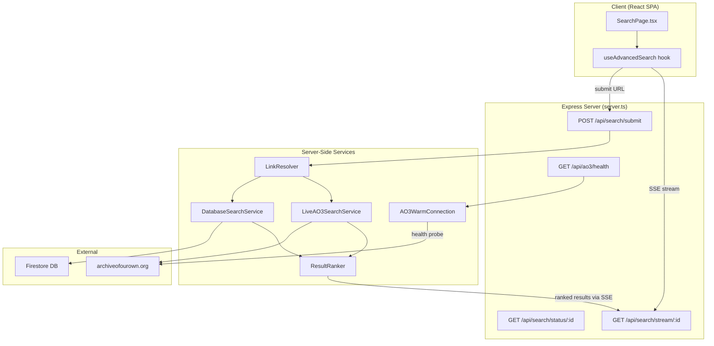

# Advanced Search — Implementation Plan

> **Goal:** When a user pastes an AO3 story link, identify the story, extract its metadata, then find similar stories by (1) querying the local Firestore database and (2) live-scraping AO3 by the story's top tags — all while maintaining AO3 availability awareness via an always-warm Playwright session with exponential-backoff recovery.

---

## Architecture Overview



---

## Phase 0 — AO3 Warm Connection & Health Monitoring

> **The escalating pullback system.** A background Playwright session that boots with the server, pings AO3 periodically, and maintains a real-time health status the UI can query.

### 0.1 New Service: `src/services/ao3WarmConnection.ts`

This is a **singleton** that lives for the lifetime of the server process.

```
┌──────────────────────────────────────────────────────────────┐
│  AO3WarmConnection (Singleton)                               │
├──────────────────────────────────────────────────────────────┤
│  State:                                                      │
│    status: 'booting' | 'healthy' | 'degraded' | 'banned'     │
│    consecutiveFailures: number                               │
│    lastSuccessfulProbe: Date | null                           │
│    nextProbeAt: Date                                         │
│    browser: Browser (Playwright)                             │
│    context: BrowserContext                                   │
├──────────────────────────────────────────────────────────────┤
│  Methods:                                                    │
│    boot()          → Launches browser, starts probe loop     │
│    probe()         → Fetches AO3 /media, checks for 200     │
│    getStatus()     → Returns { status, retryIn, since }      │
│    getContext()    → Returns BrowserContext for reuse         │
│    shutdown()      → Graceful cleanup                        │
├──────────────────────────────────────────────────────────────┤
│  Probe Schedule (Exponential Backoff / "Escalating Pullback")│
│    healthy:     probe every 60s                              │
│    1st fail:    retry in 30s                                 │
│    2nd fail:    retry in 60s                                 │
│    3rd fail:    retry in 120s                                │
│    4th fail:    retry in 240s                                │
│    5th fail:    retry in 480s                                │
│    6th+ fail:   retry in 900s (15 min cap), status='banned'  │
│    On success:  reset to 60s, status='healthy'               │
└──────────────────────────────────────────────────────────────┘
```

**Key design decisions:**
- Reuses the existing `BaseScraper`'s user-agent rotation and cookie setup, but in a **shared browser context** so the search service doesn't need to launch its own browser.
- The `getContext()` method lets the `LiveAO3SearchService` borrow the warm browser context rather than cold-starting one per search.
- The probe URL is `https://archiveofourown.org/media` — a lightweight page that doesn't stress AO3 but verifies both DNS resolution and HTTP status.

### 0.2 Server Integration

In [server.ts](file:///home/itorousa/Documents/Code/fannexus/server.ts):

```typescript
// At server boot
const ao3Connection = AO3WarmConnection.getInstance();
ao3Connection.boot(); // non-blocking, runs in background

// Health endpoint
app.get('/api/ao3/health', (req, res) => {
  res.json(ao3Connection.getStatus());
});

// Graceful shutdown
process.on('SIGTERM', () => ao3Connection.shutdown());
```

### 0.3 Client Health Awareness

The `SearchPage` polls `/api/ao3/health` on mount and shows a subtle banner if AO3 is degraded/banned:

| Status | Banner |
|--------|--------|
| `healthy` | None (hidden) |
| `degraded` | ⚠️ "AO3 is responding slowly. Live results may be delayed." |
| `banned` | 🔴 "AO3 is temporarily unavailable. We'll use cached results and retry automatically." |

---

## Phase 1 — URL Normalization & Validation

> **The Link Resolver.** Takes any AO3 URL variant and normalizes it to the canonical form `https://archiveofourown.org/works/{id}`.

### 1.1 New Utility: `src/services/linkResolver.ts`

```
Input variants (all should resolve to the same story):
  ✓ https://archiveofourown.org/works/74046506
  ✓ https://archiveofourown.org/works/74046506?view_full_work=true
  ✓ https://archiveofourown.org/works/74046506/chapters/193175941
  ✓ https://archiveofourown.org/works/74046506/chapters/202292316
  ✓ https://archiveofourown.org/works/74046506/navigate
  ✓ https://archiveofourown.org/works/74046506/comments
  ✗ https://archiveofourown.org/users/someuser (not a work)
  ✗ https://fanfiction.net/s/12345 (not AO3 — future support)

Output:
  {
    isValid: true,
    canonicalUrl: "https://archiveofourown.org/works/74046506",
    ao3Id: "74046506",
    sourceSite: "AO3"
  }
```

**Implementation:**

```typescript
const AO3_WORK_REGEX = /^https?:\/\/(?:www\.)?archiveofourown\.org\/works\/(\d+)/;

export function resolveAO3Link(rawUrl: string): ResolvedLink | null {
  const match = rawUrl.trim().match(AO3_WORK_REGEX);
  if (!match) return null;
  
  const ao3Id = match[1];
  return {
    isValid: true,
    canonicalUrl: `https://archiveofourown.org/works/${ao3Id}`,
    ao3Id,
    sourceSite: 'AO3' as const,
  };
}
```

This is intentionally simple and deterministic — no network call needed.

---

## Phase 2 — Database-First Lookup

> **Step 1 of the search flow.** Before touching AO3 at all, check if we already have metadata for this story.

### 2.1 New Service: `src/services/databaseSearchService.ts`

```
DatabaseSearchService
├── lookupByAo3Id(id: string) → StoryMetadata | null
│     Firestore: doc('stories', id)
│
├── findSimilarByTags(tags: string[], fandoms: string[], limit: number)
│     → StoryMetadata[]
│     Strategy:
│       1. Query where('tags', 'array-contains-any', topTags) — Firestore limit: 30 values
│       2. Query where('fandoms', 'array-contains-any', fandoms) — separate query
│       3. Merge + deduplicate results
│       4. Score each result by tag overlap count
│       5. Return top N by score
│
└── findSimilarByFandom(fandoms: string[], excludeId: string, limit: number)
      → StoryMetadata[]
      Fallback query for when the story has fewer than 5 tags
```

**Tag selection strategy for `findSimilarByTags`:**

Given a source story's tags, we pick the **top 7 most specific** tags:
1. All freeform tags (`tags[]`) — these are the most descriptive
2. Relationship tags (`relationships[]`) — high signal for similar stories
3. Character tags (`characters[]`) — moderate signal
4. Exclude generic tags like "Fluff", "Angst" if we have more specific ones

> [!NOTE]
> Firestore's `array-contains-any` is limited to 30 disjunction values per query. Since we're searching across multiple tag fields, we'll batch into separate queries and merge results client-side (server-side, technically).

### 2.2 Similarity Scoring

```typescript
function scoreOverlap(source: StoryMetadata, candidate: StoryMetadata): number {
  let score = 0;
  const sourceTagSet = new Set([
    ...source.tags,
    ...source.relationships,
    ...source.characters,
    ...source.fandoms,
  ]);

  // Tag matches (weighted)
  for (const tag of candidate.tags) {
    if (sourceTagSet.has(tag)) score += 3;  // Freeform tag match = high signal
  }
  for (const rel of candidate.relationships) {
    if (sourceTagSet.has(rel)) score += 4;  // Relationship match = highest signal
  }
  for (const char of candidate.characters) {
    if (sourceTagSet.has(char)) score += 1;  // Character match = moderate
  }
  for (const fandom of candidate.fandoms) {
    if (sourceTagSet.has(fandom)) score += 2;  // Same fandom = expected but relevant
  }

  // Bonus: same rating
  if (source.rating === candidate.rating) score += 1;

  // Bonus: similar word count (within 50%)
  const ratio = candidate.wordCount / Math.max(source.wordCount, 1);
  if (ratio >= 0.5 && ratio <= 2.0) score += 1;

  return score;
}
```

---

## Phase 3 — Live AO3 Tag Search (The Scraper-Powered Pipeline)

> **Step 2 of the search flow.** Runs in parallel with Phase 2. Searches AO3 by the source story's top tags, scrapes results, and ranks them.

### 3.1 New Service: `src/services/liveAO3SearchService.ts`

This service **borrows** the Playwright browser context from `AO3WarmConnection` rather than launching its own.

```
LiveAO3SearchService
├── searchByTags(sourceStory: StoryMetadata, options: SearchOptions)
│     → AsyncGenerator<SearchProgress>  (yields progress updates)
│
│   Flow:
│   1. Select top 5 tags from sourceStory (most specific freeform tags)
│   2. For each tag, construct AO3 tag search URL:
│      https://archiveofourown.org/tags/{encoded_tag}/works
│   3. Scrape up to 10 pages (200 results) per tag
│   4. Deduplicate across tags (by ao3Id)
│   5. Score by tag overlap with source story
│   6. Yield batches of results as they arrive (for SSE streaming)
│
└── Internal methods:
    ├── buildTagSearchUrl(tag: string, page: number) → string
    ├── scrapeSearchResults(url: string) → StoryMetadata[]
    └── deduplicateAndRank(results: StoryMetadata[], source: StoryMetadata) → RankedResult[]
```

**Tag search URL format on AO3:**
```
https://archiveofourown.org/tags/{encoded_tag_name}/works?page=1
```

> [!IMPORTANT]
> AO3 tag URLs use their own URL encoding scheme. Tags with `/` become `*s*`, tags with `&` become `*a*`, and tags with `.` become `*d*`. We need to handle this encoding. The existing `ao3Scraper.ts` already deals with encoded fandom URLs, but we'll need a dedicated tag-to-URL encoder.

### 3.2 Rate Limiting & Backoff Integration

The live search service respects the warm connection's health status:

```
if (ao3Connection.getStatus().status === 'banned') {
  // Skip live search entirely, rely on DB results only
  yield { type: 'ao3_unavailable', message: '...' };
  return;
}
```

Between each tag search, enforce a **3–5 second delay** (jittered) to avoid triggering AO3's rate limiter. This means a full 5-tag search with 10 pages each takes ~3–5 minutes worst case, but results stream progressively to the user.

### 3.3 Reusing Existing Scraper Infrastructure

The `parseWorkBlurb` method in [ao3Scraper.ts](file:///home/itorousa/Documents/Code/fannexus/src/services/scrapers/ao3/ao3Scraper.ts) already extracts full `StoryMetadata` from AO3 listing pages. The live search service will:

1. Use the warm connection's `BrowserContext` to fetch tag search pages
2. Pass the HTML to a shared `parseWorkBlurb` extractor (refactored out of the `AO3Scraper` class into a standalone function)
3. This avoids duplicating 200+ lines of parsing logic

---

## Phase 4 — Search Orchestration & Result Streaming

> **The coordinator.** Manages the parallel DB + live search pipelines and streams results to the client via Server-Sent Events.

### 4.1 New Service: `src/services/searchOrchestrator.ts`

```
SearchOrchestrator
├── execute(resolvedLink: ResolvedLink) → SearchSession
│
│   Flow:
│   1. Resolve URL → get ao3Id
│   2. Lookup story in Firestore by ao3Id
│   3. If NOT found: scrape the single work page to get metadata (one-off)
│   4. Now we have sourceStory: StoryMetadata
│   5. Launch TWO parallel pipelines:
│      a) DatabaseSearchService.findSimilarByTags(...)  → immediate results
│      b) LiveAO3SearchService.searchByTags(...)        → streaming results
│   6. Merge, deduplicate (by ao3Id), and rank all results
│   7. Emit events via the SearchSession event emitter
│
├── SearchSession extends EventEmitter
│   Events:
│     'source'     → { sourceStory: StoryMetadata }
│     'db_results'  → { results: RankedResult[], source: 'database' }
│     'live_batch'  → { results: RankedResult[], source: 'ao3_live', tag: string, progress: '2/5' }
│     'ao3_status'  → { status: 'searching' | 'unavailable' | 'complete' }
│     'complete'    → { totalResults: number, timeTakenMs: number }
│     'error'       → { message: string, recoverable: boolean }
```

### 4.2 If the Story Isn't in Our DB

When the user pastes a link to a story we haven't scraped yet:

1. Scrape the individual work page (`/works/{id}`) to get its metadata
2. **Optionally** save it to Firestore (so it's cached for future searches)
3. Use the scraped metadata as the source for the similarity search

This requires adding a `scrapeSingleWork(url: string)` method to the `AO3Scraper` class (currently it throws `'Single work detail scraping not implemented'`).

> [!WARNING]
> This is the one scenario where the search depends on AO3 being available. If AO3 is banned, the search cannot proceed for unknown stories. The UI should clearly communicate: *"We don't have this story in our database and can't reach AO3 right now. Please try again later."*

---

## Phase 5 — Server API Endpoints

### 5.1 Updated `server.ts` Endpoints

| Method | Path | Purpose |
|--------|------|---------|
| `GET` | `/api/ao3/health` | Returns AO3 connection status |
| `POST` | `/api/search/submit` | Accepts `{ url: string }`, validates, starts search, returns `{ sessionId }` |
| `GET` | `/api/search/stream/:sessionId` | SSE endpoint — streams search progress and results |

**SSE Stream Events:**

```
event: source
data: { "story": { ...StoryMetadata } }

event: db_results
data: { "results": [...], "count": 12 }

event: live_progress
data: { "tag": "Enemies to Lovers", "page": 3, "found": 47, "progress": "2/5" }

event: live_batch
data: { "results": [...], "count": 8 }

event: ao3_status
data: { "status": "unavailable", "message": "AO3 is rate-limited. Showing cached results only." }

event: complete
data: { "totalResults": 45, "timeTakenMs": 12400 }
```

### 5.2 Session Management

Active search sessions are stored in a `Map<string, SearchSession>` in server memory (no persistence needed — searches are ephemeral). Sessions auto-expire after 10 minutes.

---

## Phase 6 — Client-Side Integration

### 6.1 New Hook: `src/hooks/useAdvancedSearch.ts`

```typescript
interface UseAdvancedSearchReturn {
  // State
  status: 'idle' | 'validating' | 'resolving' | 'searching' | 'complete' | 'error';
  sourceStory: StoryMetadata | null;
  dbResults: RankedResult[];
  liveResults: RankedResult[];
  allResults: RankedResult[];        // merged, deduped, sorted
  ao3Health: AO3HealthStatus;
  searchProgress: SearchProgress;    // which tag, what page, etc.
  error: string | null;

  // Actions
  submitUrl: (url: string) => void;
  clearResults: () => void;
}
```

**Flow from the hook's perspective:**

```
1. User pastes URL → submitUrl(url)
2. Client-side validation via resolveAO3Link() — instant, no network
3. POST /api/search/submit { url } → get sessionId
4. Open EventSource(/api/search/stream/:sessionId)
5. Process events:
   - 'source'      → set sourceStory, show metadata card
   - 'db_results'  → populate first batch of results (fast, <1s)
   - 'live_batch'  → merge into results, re-rank, show progressively
   - 'live_progress' → update progress indicator
   - 'ao3_status'  → show/hide AO3 status banner
   - 'complete'    → finalize, close EventSource
   - 'error'       → show error state
```

### 6.2 Redesigned `SearchPage.tsx`

The current [SearchPage.tsx](file:///home/itorousa/Documents/Code/fannexus/src/pages/SearchPage.tsx) is a placeholder with a simulated 2.5s timeout. It will be completely reworked:

```
┌─────────────────────────────────────────────────────────────┐
│                    SEARCH PAGE LAYOUT                        │
├─────────────────────────────────────────────────────────────┤
│                                                              │
│  ┌── AO3 Health Banner (conditional) ──────────────────────┐ │
│  │ ⚠️ AO3 is responding slowly. Results may be delayed.    │ │
│  └─────────────────────────────────────────────────────────┘ │
│                                                              │
│  ┌── URL Input Bar ───────────────────────────────────────┐  │
│  │ 🔗 https://archiveofourown.org/works/74046506   [Find] │  │
│  └────────────────────────────────────────────────────────┘  │
│                                                              │
│  ┌── Source Story Card (appears after resolution) ────────┐  │
│  │  📖 "The Dragon's Gambit"                              │  │
│  │  by Author Name · Harry Potter · 125,000 words         │  │
│  │  Tags: Enemies to Lovers, Slow Burn, War Era, ...      │  │
│  └────────────────────────────────────────────────────────┘  │
│                                                              │
│  ┌── Search Progress (during search) ─────────────────────┐  │
│  │  Searching AO3 for "Enemies to Lovers" (3/5 tags)...   │  │
│  │  ████████░░░░░░░░ 47 stories found                     │  │
│  └────────────────────────────────────────────────────────┘  │
│                                                              │
│  ┌── Results Grid ────────────────────────────────────────┐  │
│  │  Results appear progressively as they're found.        │  │
│  │  DB results appear first (< 1 second).                 │  │
│  │  Live AO3 results merge in over 1–5 minutes.           │  │
│  │                                                        │  │
│  │  Each card shows:                                      │  │
│  │  - Title, Author, Fandom                               │  │
│  │  - Match score badge (e.g. "87% match")                │  │
│  │  - Shared tags highlighted                             │  │
│  │  - Source badge (📦 Database / 🌐 Live from AO3)       │  │
│  └────────────────────────────────────────────────────────┘  │
│                                                              │
└─────────────────────────────────────────────────────────────┘
```

---

## Phase 7 — Refactoring Existing Code

### 7.1 Extract `parseWorkBlurb` from `AO3Scraper`

Currently, [ao3Scraper.ts](file:///home/itorousa/Documents/Code/fannexus/src/services/scrapers/ao3/ao3Scraper.ts#L307-L501) has `parseWorkBlurb` as a private method. We need to:

1. Extract it into a standalone `src/services/scrapers/ao3/ao3Parser.ts`
2. Import it from both `AO3Scraper` and `LiveAO3SearchService`
3. No logic changes — just a code organization refactor

### 7.2 Add `scrapeSingleWork` to `AO3Scraper`

The current [scrape() method](file:///home/itorousa/Documents/Code/fannexus/src/services/scrapers/ao3/ao3Scraper.ts#L571-L573) throws `'not implemented'`. We need to implement it to:

1. Fetch `/works/{id}?view_adult=true`
2. Parse the full work page (different HTML structure than listing blurbs)
3. Extract the same `StoryMetadata` fields
4. This is only needed when a user searches for a story not in our database

### 7.3 No Changes Needed To

- `baseScraper.ts` — The `AO3WarmConnection` will use its own lighter Playwright management, not extend `BaseScraper`. The base scraper is tuned for bulk scraping sessions, not persistent connections.
- `scrapingOrchestrator.ts` — The bulk scraper pipeline is unrelated to the search feature.
- `firebaseCoordination.ts` — Search doesn't need Firebase coordination.

---

## File Manifest

### New Files

| File | Purpose |
|------|---------|
| `src/services/ao3WarmConnection.ts` | Singleton: persistent Playwright session, health probing, exponential backoff |
| `src/services/linkResolver.ts` | URL validation & normalization |
| `src/services/databaseSearchService.ts` | Firestore similarity queries |
| `src/services/liveAO3SearchService.ts` | Live AO3 tag-based scraping |
| `src/services/searchOrchestrator.ts` | Coordinates DB + live search, manages sessions |
| `src/services/resultRanker.ts` | Tag overlap scoring algorithm |
| `src/services/scrapers/ao3/ao3Parser.ts` | Extracted `parseWorkBlurb` + new `parseSingleWorkPage` |
| `src/hooks/useAdvancedSearch.ts` | React hook wrapping SSE + state management |
| `src/types/search.ts` | New types: `ResolvedLink`, `RankedResult`, `SearchProgress`, `AO3HealthStatus`, `SearchSession` |

### Modified Files

| File | Changes |
|------|---------|
| `server.ts` | Add 3 new API endpoints, boot `AO3WarmConnection` |
| `src/pages/SearchPage.tsx` | Complete rewrite — progressive result display |
| `src/services/scrapers/ao3/ao3Scraper.ts` | Extract `parseWorkBlurb`, implement `scrapeSingleWork` |

### Untouched Files

| File | Reason |
|------|--------|
| `App.tsx` | Routing already works (`/search` → `SearchPage`) |
| `HomePage.tsx` | No changes needed |
| `StoryPage.tsx` | "Find Similar" button already links to `/search?url=...` |
| `baseScraper.ts` | Bulk scraper infrastructure, not used by search |
| `scrapingOrchestrator.ts` | Separate system |

---

## Execution Order

```mermaid
gantt
  title Implementation Order
  dateFormat X
  axisFormat %s
  
  section Foundation
    Types (search.ts)                    :t1, 0, 1
    LinkResolver                         :t2, 0, 1
    ResultRanker                         :t3, 0, 1
  
  section Server Services
    AO3WarmConnection                    :t4, 1, 3
    Extract ao3Parser.ts                 :t5, 1, 2
    DatabaseSearchService                :t6, 2, 3
    LiveAO3SearchService                 :t7, 3, 5
    SearchOrchestrator                   :t8, 5, 6
  
  section API Layer
    Server endpoints + SSE               :t9, 6, 7
  
  section Client
    useAdvancedSearch hook                :t10, 7, 8
    SearchPage.tsx redesign              :t11, 8, 10
```



> [!TIP]
> **Recommended implementation order:**
> 1. `types/search.ts` + `linkResolver.ts` + `resultRanker.ts` (pure functions, instant to test)
> 2. `ao3WarmConnection.ts` (can test independently with `node` CLI)
> 3. Extract `ao3Parser.ts` from `ao3Scraper.ts`
> 4. `databaseSearchService.ts` (test against live Firestore)
> 5. `liveAO3SearchService.ts` (test with a real AO3 tag page)
> 6. `searchOrchestrator.ts` (integration of 4 + 5)
> 7. Server endpoints in `server.ts`
> 8. `useAdvancedSearch.ts` hook
> 9. `SearchPage.tsx` redesign

---

## Open Questions for Review

1. **Result count per tag:** 200 results (10 pages × 20/page) across 5 tags = up to 1,000 raw results. After dedup and ranking, this should yield 100–300 unique stories. Is that the right scale, or should we go shallower (5 pages per tag) for speed?

2. **Caching scraped search results:** Should we save live-scraped results to Firestore (enriching our database over time), or keep them ephemeral? Saving them means every search grows the DB, but adds write costs.

3. **Unknown story fallback:** When the story isn't in our DB and AO3 is banned, should we show an error immediately, or queue the search and notify the user when AO3 comes back?

4. **AO3 tag URL encoding:** AO3 uses a non-standard encoding for tag URLs (e.g. `/` → `*s*`). Should we scrape the tag URL from the work page itself (guaranteed correct) rather than trying to encode it ourselves?
